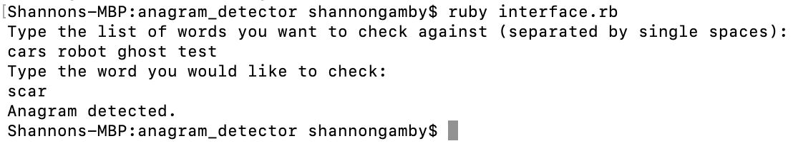

[](https://coveralls.io/github/shannongamby/anagram_detector?branch=master)
# Anagram Detector

I used TDD to complete this task in Ruby.

## Set Up

- Clone this repo and move into the anagram_detector directory: `cd anagram_detector`
- Run `bundle install` to install dependencies.
- Use `rspec` to run tests.

## Usage

Run the command `ruby interface.rb` and follow the instructions to interact with the app.
  


## User Story
```
As a feature of an app, 
I would like to check whether or not a word is an anagram of a given set of words 
So that I can prevent users from inputting disallowed words.
```
## Acceptance Criteria
1. The feature can run as a standalone application
2. It takes a configurable list of words to check against
3. Outputs whether or not input words are an anagram of any word in the list
